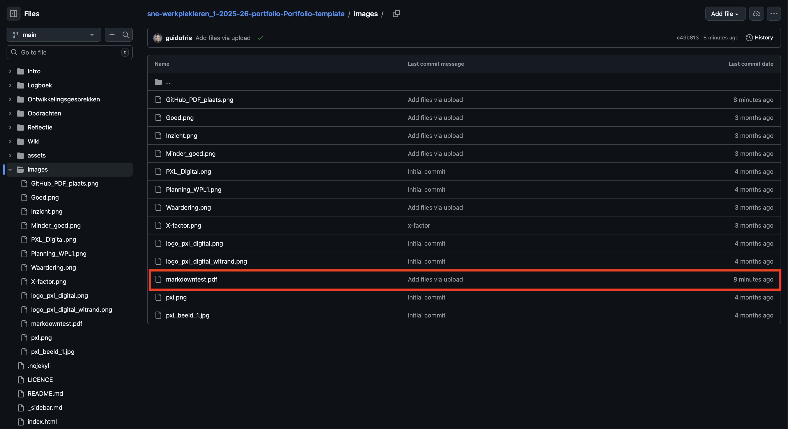

## Extra info over markdown
Extra info is te vinden via GitHub zelf: [link voor markdown info](https://education.github.com/experiences/understanding_markdown)

## PDF tonen
```bash
<center>
  <object data="./markdowntest.pdf" type="application/pdf" width="700px" height="700px">
   <embed src="./images/markdowntest.pdf">
      <p>This browser does not support PDFs. Please download the PDF to view it: <a href="./markdowntest.pdf">Download PDF</a>.</p>
    </embed>
  </object>
</center>
```

In bovenstaande voorbeeld staat het bestand markdowntest.pdf in de hoofdfolder van GitHub zoals te zien in de afbeelding. Als je deze wil vergroten moet je nog spelen met je width, height. wil je deze niet gecentreerd moet je de center blokjes weghalen.



<center>
  <object data="./images/markdowntest.pdf" type="application/pdf" width="700px" height="700px">
   <embed src="./images/markdowntest.pdf">
      <p>This browser does not support PDFs. Please download the PDF to view it: <a href="./images/markdowntest.pdf">Download PDF</a>.</p>
    </embed>
  </object>
</center>

## Afbeeldingen tonen
Om afbeeldingen te tonen heb je 2 manieren:

### Via HTML
```bash

```
Hier heb je de mogelijkheid om de grootte van je afbeelding mooi weer te geven in %, aantal pixels, ... Let ook dat je hier met ./ begint als in de root van je GitHub en daarna geef je aan welke mappen en welk bestand je wil gebruiken.


### Via Markdown
```bash

```
Hier heb niet de mogelijkheid om de grootte van je afbeelding mee te geven, je zal dus altijd de ware grootte te zien krijgen. Let hier ook op dat je in de map dat je je bevindt begint en we dus eerst met ../ een map omhoog gaan naar de root van GitHub om daarna de mappen en het bestand mee te geven dat we willen gebruiken.


